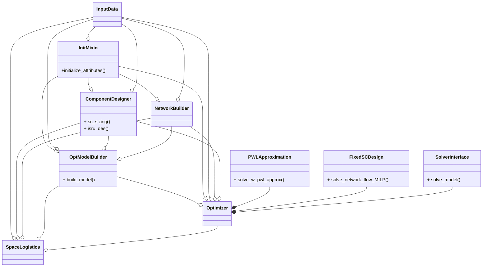
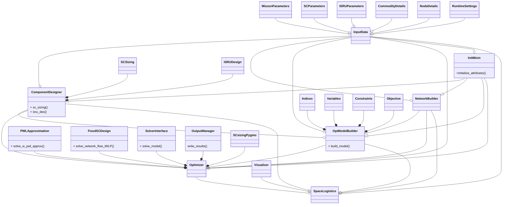
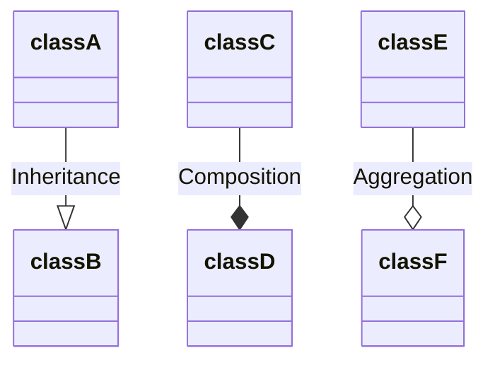

Space Logistics Optimization in Python. See `docs/tutorials.md` for a quick start and an example usage.

# For Windows OS
Installation on a Linux machine is recommended, but for a Windows OS, please try instructions in `windows-installation-guide.md`. The performance on non-Linux machines is not guaranteed.

## Docker on WSL2

# For Linux OS
## Prerequisites 

Assuming python is installed system-wide, install `poetry` by running:
```sh
curl -sSL https://install.python-poetry.org | python3 -
```
It should be installed to `$HOME/.local/bin` by default, so no need to set up $PATH. If `which poetry` does not work, try `source ~/.bashrc` or `source ~/.zshrc` or similar.
Alternatively, you can `pip install poetry` inside a virtual environment.

Install SCIP as a mixed-integer program solver following `docs/scip_installation_on_linux.md`. Commercial solvers such as Gurobi and CPLEX would show much higher performance and shorter computation time (if available).

## Installation on Linux

To build and test your environment with `conda`, just run the following in the root dir of this repo (make sure to run `install_for_linux.sh` with your shell interpreter; e.g., change it from `zsh` to `bash` if needed):

```sh
chmod +x install_for_linux_w_conda.sh
zsh ./install_for_linux_w_conda.sh
```

If the shell script doesn't work for you, run (change the environment name if needed)

```sh
conda create -n slpy python=3.11.2
conda activate slpy
poetry install
```

If `virtualenv` or similar is preferred, run `poetry install` in the newly created virtual environment with python version `3.11.2`.

<!-- add mamba 2025/08/19 -->
If already installed micromamba, run (change the environment name if needed)

```bash
micromamba env create -n slpy -f environment.yml
```

# Test
The installation shell script should let you run tests. However, if you need to run tests after installation, run:

```sh
PYTHONPATH=src pytest
```

# Class Diagram
Diagrams to show how classes in this code base interact

## Simplified Class Diagram

Main class methods you might use as a user are also included



## Full Class Diagram



Class diagram notations are as follows:



where

- classB inherits classA
- classD composes (i.e., owns) classC
- classF aggregates (i.e., contains) classE

See [inheritance vs composition vs aggregation](https://dev.to/adhirajk/inheritance-vs-composition-vs-aggregation-432i) for your reference. In short, an aggregated class can exist without its aggregating class but a composed class cannot without its composing class (stronger dependency).

# Acknowledgment
This material is based upon work supported by the National Science Foundation under Award No. 1942559.
Any opinions, findings and conclusions or recommendations expressed in this material are those of the author(s) and do not necessarily reflect the views of the National Science Foundation.